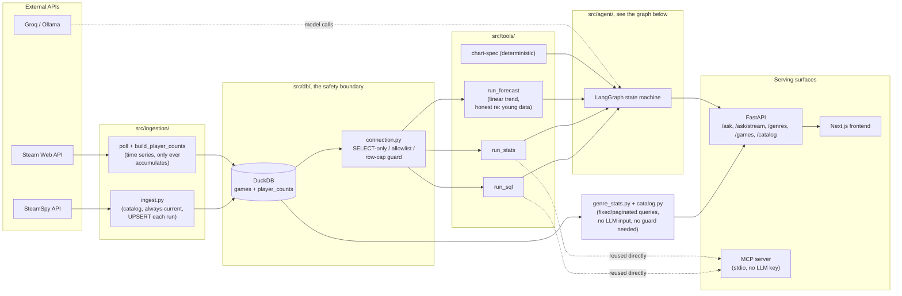
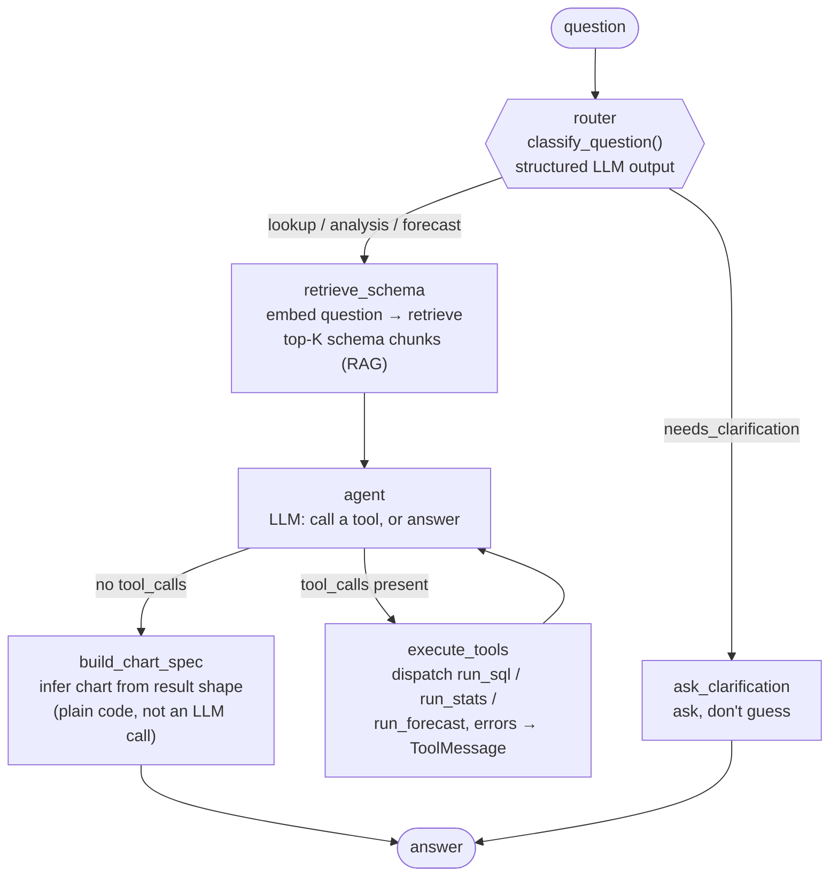
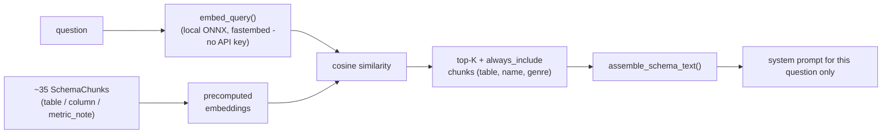
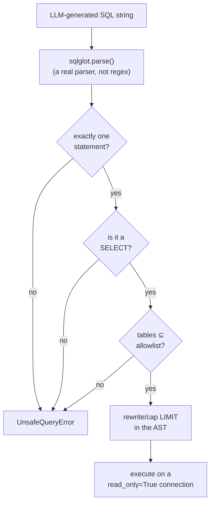
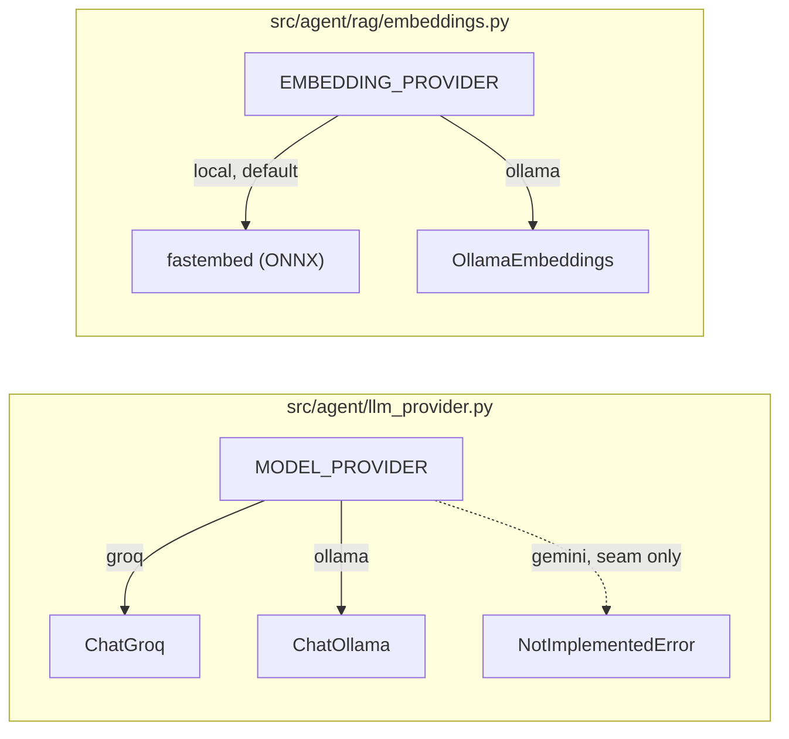

# Architecture

This is a snapshot of the system's *current* structure, what it looks
like now and why it's built this way. For the roadmap see
[PLAN.md](PLAN.md); for the decision-by-decision history (what broke, what
got tried, what surprised me) see [DOCEXP.md](DOCEXP.md). This document
doesn't repeat that history, it's the thing you'd read cold to understand
the shape of the system before diving into either.

A real run through the agent, the `lookup` example below, captured frame
by frame from the interactive version, not staged:


There's also a **live, interactive** version, same graph, but you pick
any of 4 real questions (including a genuine self-correction retry) and
step or auto-play through exactly what happened at each node, with the
full captured state, not just the GIF's single trace. It's a private
Claude Artifact; share it from its own page's share menu if you want the
link public (e.g. from a portfolio page).

## System overview



Two things this diagram is making a point of, not just showing:

- **`connection.py` sits between DuckDB and every tool**, `run_sql` and
  `run_stats` cannot reach the database except through the guard. There is
  exactly one safety boundary, not one per caller.
- **The MCP server reuses `run_sql`/`run_stats` directly**, not a second
  implementation. Whatever guarantees the agent gets, the MCP server gets
  identically, for free.
- **`genre_stats.py` and `catalog.py` both bypass `connection.py` on
  purpose**, for related but distinct reasons. The guard exists to
  constrain LLM-*generated* SQL; neither of these is that. `genre_stats.py`
  runs one fixed, hand-written query with no user or model input in it at
  all, routing it through the same guard as `run_sql` would be safety
  theater, not safety. `catalog.py` (the `/catalog` browse page's search/
  sort/filter/paginate) does take real user input, but never interpolates
  it into SQL: the sort column comes from a Python allowlist dict, and
  search/genre filtering happen in Python after one unparameterized fetch,
  not via a dynamically built query string. Different mechanism, same
  result, no path from user input to arbitrary SQL. Both exist so the
  frontend's genre counts and catalog listing are computed live from
  whatever's actually in `games` (see DOCEXP.md's Slice 9 addendum), not a
  number baked into frontend source at design time.

## The agent graph

This is the part actually worth drawing carefully, it's a hand-written
LangGraph state machine, not a prebuilt agent constructor
(`create_react_agent` et al. are deliberately not used, see "Design
choices" below for why that's a real decision, not an oversight).



`forecast` used to be its own terminal node here, an honest "not built yet"
with no tool calls possible at all, back when neither a forecasting tool nor
real time-series data existed. Both exist now (`player_counts` since Slice 7,
`run_forecast` since this addendum), so `forecast` flows through the same
loop as `lookup`/`analysis`. The honesty didn't move to a route-level gate,
though, it moved *into* `run_forecast` itself: the tool checks how many real
snapshots exist for the game in question before fitting anything, and
returns a structured "not enough history yet" result instead of a fabricated
projection when there's fewer than 2. See `src/tools/forecast_tool.py`'s
docstring.

**Every box is a real Python function, traced individually in LangSmith.**
There's no hidden orchestration layer between these nodes, the edges in
this diagram are exactly the edges in `build_graph()` in
`src/agent/graph.py`.

### Node by node

| Node | Reads | Writes | What it actually does |
|---|---|---|---|
| `router` | `question` | `route`, `clarifying_question` | One structured-output LLM call (`RouteDecision`, a Pydantic model with a `Literal` field), always exactly one of 4 categories, never free text to parse |
| `retrieve_schema` | `question`, `route` | `messages` (system + human), `retrieved_chunk_ids` | Embeds the question, cosine-similarity ranks against ~24 schema chunks, assembles only the relevant ones into the system prompt, see "RAG" below |
| `agent` | `messages`, `route`, `attempts` | `messages` (appends one AI message) | Calls the LLM with tools bound *conditionally on route*, `lookup` gets `[run_sql]`, `analysis` gets `[run_sql, run_stats]`, `forecast` gets `[run_sql, run_forecast]`. Once `attempts >= SQL_MAX_RETRIES`, binds no tools at all |
| `execute_tools` | `messages` (last AI message's tool_calls), `attempts`, `tool_errors` | `messages` (ToolMessages), `last_successful_*`, `last_stats_*`, `last_forecast_*`, `attempts`, `tool_errors` | Dispatches by tool name to the guarded implementation; catches `UnsafeQueryError`/`duckdb.Error`/`ValueError` and turns them into a message the model reads next turn. `attempts` counts every tool call; `tool_errors` (Slice 23) counts only the ones that actually failed, kept separate so a legitimate multi-step question never looks like a retry |
| `build_chart_spec` | `last_successful_columns`, `last_successful_rows` | `chart_spec` | Pure function: column count + Python types of the values → `bar`/`scatter`/`None`. No LLM call |
| `ask_clarification` | `clarifying_question` | `messages` | Returns the router's own generated clarifying question as the answer |

### The two structural guarantees worth naming

**Termination is structural, not requested.** `agent` stops binding tools
once `attempts` hits the retry cap, the model is not *asked* to stop
calling tools, it is made *unable* to. This is the difference between "the
loop terminates because the prompt says please stop" and "the loop
terminates because there is no tool to call." Verified this holds even
when the model behaves unexpectedly (Slice 7's DOCEXP entry: a garbled,
non-tool-call response from a retry attempt still terminated cleanly, no
infinite loop, because `build_chart_spec` was still the only reachable
next step once `route_after_agent` saw no `tool_calls`).

**Capability is gated by classification, not just labeled by it.**
`_tools_for_route()` means `lookup` and `analysis` are not two names for
the same pipeline, `analysis` alone can reach `run_stats`. The router
isn't a triage label sitting in front of one fixed pipeline; it changes
what the agent is structurally capable of doing.

## RAG: retrieval as a graph node, not a preprocessing step



The corpus (`src/agent/rag/schema_corpus.py`) is hand-written, not
generated from the DB schema automatically, each chunk is a short,
independent fact: one per table, one per column, and a handful of
`metric_note` chunks for things that aren't tied to a single column (unit
conversions, join hints, known data-quality caveats like "playtime is 0
for nearly every game, that's a SteamSpy limitation, not missing data").

`always_include` is a deliberate escape hatch, added after finding
empirically (not guessed) that pure semantic similarity under-ranks
generic-sounding columns needed by almost every question, `name` doesn't
embed close to a specific game's name, `genre` doesn't embed close to a
specific genre string. A handful of chunks bypass ranking entirely rather
than trusting the embedding model to always surface them.

**Retrieval quality is measured, not assumed** (Slice 22):
`src/evals/retrieval_eval.py` runs the real `SchemaIndex.retrieve()`
against a hand-labeled set of questions (`retrieval_golden.py`), each
paired with the specific non-`always_include` chunks it should surface -
and computes recall@k. Deliberately excludes `always_include` chunks from
every expected set, since those are returned regardless of the question
and would make the eval measure nothing about the ranking itself. Unlike
the rest of the eval harness (`src/evals/run_evals.py`), this never calls
an LLM, so it runs as a real, free regression test in CI
(`tests/test_retrieval_eval.py`) rather than a manual-only report.
Currently **1.000 recall@8 across 15 hand-labeled questions**, re-checked
fresh, not carried forward from an old run.

**The retrieval/latency trade-off, resolved in a specific order, recall
first, then cost:** `rag_top_k=8` isn't a guess at "probably enough." The
recall@k eval above is the hard constraint (must stay 1.0, CI-gated); k
was set to the *smallest* value that still clears it, so extra latency
and tokens are never spent for zero measurable recall benefit. Three
further choices reduce cost without touching that constraint:

- **A local ONNX embedder (fastembed), not a hosted embeddings API** -
  no network round-trip added to the retrieval step of every single
  question.
- **The corpus's own vectors are precomputed once and cached to disk**
  (`schema_index_cache.npz`, keyed by a hash of the corpus text -
  Slice 52), so only the live *question* gets embedded per request, not
  the whole ~35-chunk schema again on every cold start.
- **A semantic answer cache** (`src/agent/cache.py`, cosine similarity
  ≥ 0.96) sits in front of the whole pipeline, a paraphrase of a
  previous question skips retrieval *and* the LLM calls entirely. This
  is the single biggest lever for average real-traffic latency: the
  fastest retrieval is the one that never has to run.

## The safety boundary



Two independent layers, on purpose: the parser-based check
(`validate_select_only` in `src/db/connection.py`) rejects anything that
isn't a single allowlisted `SELECT` *before* it reaches DuckDB at all, and
the connection itself is opened `read_only=True` as a second, independent
layer, regex/keyword blacklisting was considered and rejected early
(Slice 1) specifically because it's defeated by comments, string literals,
and case tricks in a way a real parser isn't.

This is reached by exactly one code path regardless of caller, the
LangGraph agent's `execute_tools` node and the MCP server's `run_sql` tool
both call the same `execute_run_sql()`, which calls the same
`run_guarded_query()`. Verified directly (Slice 8): sent `DROP TABLE
games` through the MCP path and got the identical rejection message an
agent-driven query would get.

## Hallucination mitigation

Most of the mitigation here is upstream, structural, and already visible
elsewhere in this document: tool-grounding (every fact must come from a
real query, never the model's own recall), structured routing output (a
`Literal` field, not free text a model could invent a fifth category
for), and honest degradation instead of a forced guess, the forecast
tool's `insufficient_history` result being the clearest example, see
`src/tools/forecast_tool.py`'s docstring. What's below is the part that
took more than one attempt to get right, and the general lesson it left
behind.

**A real, repeated failure: an LLM asked to restate a fact it already
had.** `run_stats(mode="outliers")` computes a real z-score outlier
check and returns the exact rows that clear the threshold. The model's
job was just to *report* that list in its final answer, and it kept
padding it with an extra, unverified name that looked plausible but
wasn't in the tool's real output. Confirmed twice, across two live eval
runs, even after the prompt guidance asking it not to got progressively
more specific (name the exact field, forbid the exact mechanism
observed, a parallel `run_sql` "top N" query rendered as if every row
were a flagged outlier).

**The fix wasn't a better prompt a third time, it was removing the
model's opportunity to write that sentence at all.** For this specific
mode, the model no longer generates the outlier list in its final
answer; it isn't asked to. `_render_outliers_fact_block()`
(`src/agent/graph.py`) prints the real result straight from
`stats_result`, an f-string over the tool's own data, never an LLM
call, and the model's entire final answer is reduced to a short,
name-free interpretive comment sitting next to it. A defensive backstop
still exists for the rare compliance miss (a name from a companion
`run_sql` call slipping into that commentary gets swapped for a generic,
safe sentence, not surgically edited), but the primary guarantee doesn't
depend on the model behaving: the fact is code, not generation, so there
is nothing left to hallucinate in it.

This is the general, reusable lesson, not just a fix for one mode:
**prompting reduces the rate of a hallucination; only removing the
model's opportunity to generate the fact removes the failure mode.**
Detection-after-the-fact (a heuristic checking free text against real
data, with a retry loop) was the first design considered here and
explicitly rejected in favor of this, detection has to correctly judge
a moving target and can always miss a paraphrase; prevention has no
target to miss.

**A related, second bug the same investigation surfaced**, worth
including because it's a different failure shape entirely: sanity-
checking the fix above against the real ~1000-game local catalog found
`run_stats`'s own z-score test flagging 79 games as "discount_pct
outliers", not a hallucination, a real, technically-computed, but
statistically meaningless result. Discount percentages cluster at
conventional sale tiers (25/50/75/90%) rather than spreading smoothly,
which breaks the one assumption a z-score test depends on. Real outliers
are rare by definition (a normal distribution predicts ~0.6% of values
past z=2.5); seeing 79 said more about the test than about the data.
Fixed at the tool itself (`stats_tool.py`'s `_outliers()`): if more than
`MAX_PLAUSIBLE_OUTLIER_COUNT` (15, an absolute count, a fraction-based
cutoff was tried first and didn't hold up across wildly different
sample sizes) clear the threshold, the tool returns an honest
`not_normal_enough` result instead of the list, the same
honesty-over-a-technically-correct-number principle as
`insufficient_history` above. This protects any column a real question
might touch, not just the ones this project's own eval questions happen
to test.

## Provider seams

Two independent single-config-value seams, swapping either never touches
calling code:



These are two *different* axes on purpose, not one, Groq has no
embeddings endpoint at all, so "reuse whatever `MODEL_PROVIDER` is" was
never a valid design for embeddings. `get_llm()` and `get_embedder()` are
the only functions in the codebase allowed to branch on their respective
config value; the graph and the RAG index just call them and get back
something they can use, with no idea what's behind it.

## Design choices, named

A few decisions that recur throughout the codebase, stated explicitly
once here rather than re-derived from scattered comments:

- **No prebuilt agent constructor.** `langgraph.prebuilt.create_react_agent`
  would have built the tool-calling loop in a few lines. Written by hand
  instead so every step is something chosen and explainable, the
  self-correction path, the RAG step, the route-gated toolset, and the
  structural termination guarantee all depend on control that a prebuilt
  constructor wouldn't expose.
- **Guardrails live in code, at the data-access boundary, never in the
  prompt.** The SQL guard doesn't trust the system prompt telling the
  model to "only write SELECT statements"; it enforces that independent of
  what the model was told or how it was tricked.
- **Deterministic work stays out of the LLM.** The chart-spec generator
  and the SQL row-cap rewrite are both plain code, not prompts, anywhere
  a decision has one mechanically correct answer given the input shape,
  code makes that decision, not a model call.
- **Tools are shared, not reimplemented per surface.** `execute_run_sql`/
  `execute_run_stats` are called identically by the LangGraph agent and
  the MCP server. One implementation, one thing to keep correct.
- **Ingestion strategy matches data character, not convenience.** `games`
  (always-current, SteamSpy) gets UPSERTed fresh each run; `player_counts`
  (genuinely historical, Steam's live API has no history endpoint) only
  ever accumulates, built by replaying every committed snapshot. Two
  different ingestion patterns because the data has two different
  freshness contracts, not because one pattern was simpler to write twice.
- **Two config axes for "which AI provider," not one.** Model provider and
  embedding provider are separate seams (`llm_provider.py`,
  `rag/embeddings.py`) because Groq has no embeddings endpoint, conflating
  them would have made the embedding provider's default undefined the
  moment `MODEL_PROVIDER=groq`.
- **Golden-question ground truth is computed live from the DB at eval
  time, not hardcoded.** `build_golden_questions()` runs independent
  reference queries against the current `games.duckdb` every time evals
  run, so the suite stays correct after re-ingestion instead of silently
  drifting against stale expected numbers.
- **A regression check verifies a fact the label logically implies, not
  whether the answer "sounds right."** The eval that catches Slice 4's
  group-mislabeling bug doesn't parse the model's stated conclusion -
  free-to-play means price = 0 by definition, so a group claiming that
  label must have a ~$0 mean. Checking the number a correct label
  guarantees, rather than the prose around it, is what makes the catch
  reliable instead of lucky.
- **The LLM judge is a second, qualitative signal, it never gates the
  exit code.** Deterministic checks are what "regression check" means
  here; a judge's own scoring noise shouldn't make CI flaky, but it's
  still useful for catching things the deterministic checks don't
  anticipate.
- **Streaming is per-node progress events (SSE), not token-level
  streaming of the final answer.** `stream_agent()` uses LangGraph's
  `astream(..., stream_mode="updates")` to yield after each node
  completes, the same node-based, explainable design as the visible
  self-correction and RAG-retrieval nodes above, and it works the same
  regardless of which node is currently running an LLM call.

## Known limitations, and what actually addresses them

Two real, current constraints, both honestly disclosed rather than
hidden, and both handled the same way: bound the impact, don't pretend
the constraint away.

**Render's free tier spins the backend down after ~15 minutes of
inactivity, and a real cold start is genuinely slow**, measured
directly against production: **40.4 seconds** for the first request to
come back. This isn't a guess or a generic host disclaimer; it's a real
number from a real, deliberately cold instance. During that window,
Render's own proxy can return a 502/503 immediately (answering before
the container is even listening) rather than queue the request, which
used to be a real, reported bug: a single failed request to `/genres`
permanently blanked the whole genre showcase section, with no retry, no
recovery short of a manual refresh (Slice 60). Fixed at the shared
network layer (`fetchWithRetry()` in `frontend/lib/api.ts`), retries
specifically on a network error or 502/503/504, delays summing to ~50s,
so a cold start now recovers on its own instead of requiring one.
`prewarmBackend()` fires a fire-and-forget `/health` call the instant
either page mounts, so the wake-up starts while a visitor is still
reading, not only once they act. **Once the backend is actually warm,
this disappears entirely**, measured live, directly against
production: the genre showcase's real data back in 1.5s total, the
catalog page's in 0.9s, both single-attempt, no retries needed. The 40s
number is a real, physical cost of not paying for always-on hosting; the
fix makes it a bounded, self-healing wait exactly once per idle period,
not a recurring tax on every request.

**Groq's free tier has a shared daily token budget (200,000 TPD)**,
and this project adds its own tighter, self-imposed guard under that
(`daily_token_budget`, checked *before* calling the LLM at all, see
`src/api/main.py`) specifically so a cached answer keeps working even
after the budget for new questions runs out for the day. When the real
budget is genuinely exhausted, `/ask` returns an honest message asking
the user to check back once it resets, rather than a generic error -
and separately, if a real `groq.RateLimitError` reaches the agent graph
directly (the self-imposed guard didn't catch it in time), the same
honest message is what the degraded-fallback path in `router_node`/
`agent_node` returns, not the generic "try again in a moment" text used
for every other failure type (that distinction matters: a per-minute
rate limit really does clear in under a minute; a daily one needs
tomorrow). This is a real, hit-in-practice constraint during heavy
eval/testing days, not a hypothetical one, the honest message exists
because the quota has actually run out live, more than once.

## Directory map

Full run instructions live in [README.md](README.md); this is the
responsibility map, not the how-to-run guide:

```
src/
  config.py       one typed Settings object, everything else reads config through it
  ingestion/       SteamSpy + Steam Web API clients, ingest/poll/build scripts
  db/               table schema + the guarded connection (the safety boundary);
                      genre_stats.py, live genre counts for the frontend,
                      deliberately outside the guard (fixed query, no LLM input)
  agent/
    graph.py          the LangGraph state machine (this document's main subject)
    router.py          structured-output question classification
    prompts.py         system prompt assembly (schema_text + route-conditional tool guidance)
    llm_provider.py     the MODEL_PROVIDER seam
    cache.py            semantic cache (reuses the RAG embedding provider)
    rag/                schema chunk corpus, EMBEDDING_PROVIDER seam, retrieval index
  tools/            run_sql, run_stats, run_forecast, the chart-spec generator -
                      called by both the agent graph and the MCP server
  evals/            golden questions (live DB ground truth), deterministic checks,
                      LLM-as-judge, the CLI runner
  api/              FastAPI, thin, translates HTTP ⟷ agent; rate limiting
  mcp_server/       exposes src/tools/ to any MCP client, independent of the API
frontend/          Next.js UI (SSE streaming, charts, "show the work")
```
