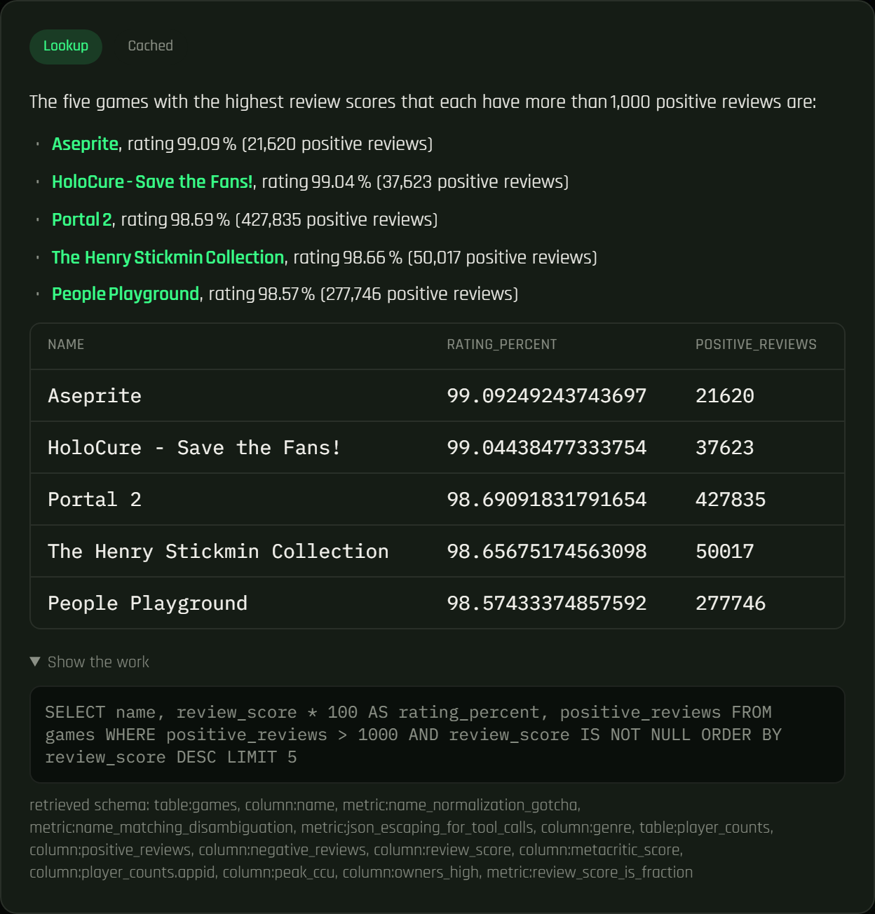

# AI Game Analyst

[](https://github.com/stefhooy/full_stack_project/actions/workflows/test.yml)
[](https://github.com/stefhooy/full_stack_project/actions/workflows/frontend-ci.yml)
[](LICENSE)


**[Try it live](https://full-stack-project-sepia-nine.vercel.app)** — ask
a real question about the video game market and watch it write the SQL
itself. (Free-tier host; the first request after a quiet stretch can
take up to a minute to wake back up — see "Deploying" below.)

An AI agent that answers plain-English questions about the video game
market by writing and running real SQL against a database it ingested
itself — not a fixed dashboard, not a chatbot answering from memory.



Built as a series of thin, working vertical slices; this snapshot is
through **Slice 32** (see [PLAN.md](PLAN.md) for the full roadmap,
[ARCHITECTURE.md](ARCHITECTURE.md) for a diagram-first tour of the current
system, and [DOCEXP.md](DOCEXP.md) for the engineering log/decisions).

## What's here right now

- A SteamSpy ingestion script that builds a local DuckDB catalog of up to
  ~1000 games (`INGEST_GAME_COUNT`, the free ceiling with the current
  ingestion code — see DOCEXP.md's Slice 9e addendum for why), enriched
  per-game with Steam's own storefront API (`store.steampowered.com/api/appdetails`
  — a second, free, no-key API distinct from both SteamSpy and the Steam Web
  API poller below) for release date, Metacritic score, platforms, and a
  curated set of category tags SteamSpy doesn't carry — see DOCEXP.md's
  Slice 11 entry for why this API and not RAWG/IGDB
- A scheduled live player-count poller (Steam Web API, no key needed) building
  a real time-series table — the two tables have opposite freshness
  contracts (the catalog is always-current and gets overwritten; player
  counts are historical and only ever accumulate) and are ingested
  accordingly, see DOCEXP.md
- A read-only, guarded DuckDB connection — SELECT-only and row-capped,
  enforced by a real SQL parser in code, not by trusting the prompt
- RAG over the DB schema: table/column/metric descriptions are chunked,
  embedded, and retrieved per-question instead of always injecting the
  whole schema into the prompt. Retrieval quality itself is measured, not
  just assumed: a hand-labeled recall@k eval (`src/evals/retrieval_eval.py`)
  checks that the right chunks actually come back for a given question,
  gated as a real, free (no LLM call) regression test in CI — currently
  a measured 1.0 recall at production's real `RAG_TOP_K`
- A supervisor-router that classifies each question (lookup / analysis /
  forecast / needs-clarification) before any DB work happens, routing
  ambiguous questions away from the SQL pipeline entirely instead of letting
  the agent guess
- A minimal LangGraph agent — `router` → `retrieve_schema` → `agent` →
  `execute_tools` → `build_chart_spec` loop — with a self-correcting retry
  loop (tool errors get fed back to the model, up to 3 attempts). This
  isn't just a claim: `tool_errors` (Slice 23) counts real failures
  separately from legitimate multi-step tool use, surfaced per-request in
  the API response and aggregated live at `/health` as `self_correction`
  — real numbers for how often self-correction fires and how often it
  actually recovers, not just an architecture description. Real token
  usage and cost (Groq's actual on-demand pricing, verified live — see
  `src/agent/pricing.py`) are tracked the same way (Slice 26): every
  `/ask`/`/ask/stream` response reports its own `total_tokens`/
  `estimated_cost_usd`, logged per request and aggregated live at
  `/health` as `usage`
- Three tools: `run_sql` (bound for every routable question), `run_stats`
  (bound only for `analysis`-routed questions) — real statistics via scipy:
  a Welch's t-test with a p-value for group comparisons, z-score outlier
  detection, and summary stats, instead of the LLM eyeballing an average
  comparison in SQL — and `run_forecast` (bound only for `forecast`-routed
  questions) — a real linear-trend projection over the live player-count
  time series, honest about insufficient history instead of fabricating a
  number when too little exists for a given game (self-upgrades to a real
  projection the moment enough real snapshots accumulate — see DOCEXP.md)
- A deterministic (non-LLM) chart-spec generator that infers a bar/scatter
  spec from a successful query's shape
- Every answer's text is guaranteed em-dash/en-dash-free — the system
  prompt asks the model not to use them, but that's a request, not a
  guarantee (confirmed: a real answer came back with one anyway), so
  `_strip_dashes()` in `src/agent/graph.py` deterministically fixes it up
  before the answer ever leaves the graph, on the one path every caller
  (API, MCP server, evals) already shares
- A FastAPI `POST /ask` endpoint wiring it all together, returning the
  answer, the SQL or stats query that was actually run, the raw rows or
  stats result, a chart spec, the route classification, and which schema
  chunks were retrieved
- An eval harness (`python -m src.evals.run_evals`) — a golden question set
  with ground truth computed live from the DB, deterministic checks, and
  an LLM-as-judge pass, runnable as a regression check with a real exit
  code; runs daily on its own via `.github/workflows/run_evals.yml`
  (Slice 27, against a small catalog the workflow builds fresh each
  time, scheduled rather than gated on every push since it makes real
  Groq calls)
- A Next.js frontend (`frontend/`) — a dark, near-black/green identity
  with a neon-green accent (Slice 17) and Rajdhani, a technical
  gaming-adjacent sans, as the site's one type face. The hero is a real,
  full-bleed film strip (`components/FilmStrip.tsx`) of real game cover
  art hotlinked live from Steam's own CDN, sliding past inside a frame
  with real film sprocket holes and a top/bottom-only accent border (a
  restrained Latin/Roman touch), pausable on hover via a native CSS
  `animation-play-state` (verified to freeze and resume exactly in
  place, not a Motion-driven tween) and again, deterministically, while
  a cover's cartridge popup is open. Clicking a cover opens
  `components/GameCartridge.tsx`, a cartridge-shaped detail card with
  that game's real info (cover, genre, release date, Metacritic,
  platforms, price, review score, owners, peak players) from the same
  data the strip already fetched, closable via its X, a backdrop click,
  or Escape, animated with a scale/fade pop rather than a shared-layout
  morph (see DOCEXP.md's Slice 18 entry for why). Genre icons carry a
  matching thin engraved-medallion ring, and the genre categorical
  palette was re-picked and validated against this app's own background
  with the dataviz skill's validator. Motion for the animated
  node-by-node progress trace,
  a genre picker (flat cards) that browses the real games behind each
  genre (`GET /games`, no LLM call, counts/labels fetched live from
  `GET /genres`), markdown-rendered answers, charts, and a "Show the
  work" panel — see `frontend/README.md`
- The agent is named **Ludo** (Latin *ludus*, "game, play") — introduced
  in the hero (a real, previously-verified Ludo answer shown in a floating
  preview panel, not a mockup) and a "Meet Ludo" section: three real
  capabilities (Ask / Investigate / Show the work, mapped to the actual
  agent graph in ARCHITECTURE.md) plus example questions that specifically
  exercise the new Slice 11 fields
- A full catalog browse page (`/catalog`) — search by name, filter by
  genre, sort by 7 fields, paginated, no LLM call (`GET /catalog`,
  `src/db/catalog.py`); for a question with an answer rather than a
  filtered list, the homepage's `/ask` is still the point
- A semantic cache (reuses the RAG embedding provider), per-IP rate
  limiting, and graceful "high demand, try again" error responses instead
  of raw stack traces
- Deployment config for the resolved hosting split: a `Dockerfile` +
  `render.yaml` for the backend (a normal Python host, not serverless —
  see "Deploying" below for why), Vercel for the frontend
- An MCP server (`src/mcp_server/`) exposing the same guarded `run_sql`/
  `run_stats` to any MCP-compatible AI app (Claude Desktop, Claude Code,
  Cursor) — free, local stdio, no LLM key needed
- A pytest suite (`tests/`, 88 tests) against the SQL guard, the stats/
  forecast/viz pure functions, the ingestion parsing, the catalog/genre
  queries, the dash-stripping guarantee, RAG retrieval quality (Slice
  22), and the self-correction attempts/tool_errors distinction (Slice
  23) — real DuckDB fixtures, not mocks of this project's own
  DB layer, and network/LLM-hitting tests are marked `live` and excluded
  by default; runs on every push/PR via `.github/workflows/test.yml`,
  alongside ruff and mypy (Slice 21). The frontend gets the equivalent
  check (lint, `tsc --noEmit`, `build`) via
  `.github/workflows/frontend-ci.yml`, scoped to `frontend/**` changes
  only

## Measured results

Real numbers from a real run of `python -m src.evals.run_evals`
(2026-08-29) against the golden question set, real Groq token usage,
and Groq's actual current on-demand pricing (verified live, not
assumed) — published as they came out, not re-run until clean. This
suite now also runs automatically, daily, in
`.github/workflows/run_evals.yml` (Slice 27). See DOCEXP.md's Slice
24/27/30 entries for full methodology and caveats.

| Metric | Result |
|---|---|
| Route accuracy | 5/5 |
| Deterministic checks | 5/5 |
| Avg LLM-judge score | 4.2/5 |
| Avg `/ask` latency | 13.3s (n=5, real full-graph runs) |
| Avg cost per question | $0.00066 (Groq on-demand list price) |
| RAG retrieval recall@8 | 1.000 (15 hand-labeled questions, Slice 22) |

Worth being honest about how this got to 5/5, since earlier versions of
this table showed a real, repeated 4/5 and described it as the same
model bug recurring: that framing was wrong. Investigating it properly
(Slice 30) found that the failing check — a free-to-play group-
mislabeling regression test from Slice 4 — hard-required a specific
tool (`run_stats`) and never actually inspected whether the model's
answer was correct when it used plain SQL instead. Re-checking every
SQL string that check had ever failed on showed the group was
correctly filtered on `price_usd = 0` every single time; the model was
right, the check wasn't looking at the right thing. Fixed the check to
verify the real returned value regardless of which tool produced it,
not the model's behavior. A 5/5 that comes from fixing a check to test
what it actually claims to test is worth exactly as much as it says;
still no guarantee every future run stays clean, since the model's
tool choice remains nondeterministic even now that the check judges it
fairly.

Cache hit behavior was checked directly against a live backend rather
than assumed: a genuinely different question correctly missed, a
natural real-world paraphrase also missed (the 0.93 similarity
threshold turned out more conservative in practice than expected — a
real, useful finding, not a flattering one), and a near-identical
reword correctly hit. Precise, no false positives observed, but
conservative — there's no organic production traffic yet to report a
real aggregate hit rate from, and inventing one would contradict this
whole project's own no-fabricated-numbers discipline.

## Setup

Dependencies are managed with [uv](https://docs.astral.sh/uv/) —
`pyproject.toml` + `uv.lock`, not requirements.txt. The base dependency set
is deliberately lean (just what ingestion/db/config need); the `agent`
extra adds the LLM/RAG/API stack on top — see the comments in
`pyproject.toml` for why it's split that way. `.python-version` pins
Python 3.12 — uv's newest available standalone build (3.14.2, at the time
this was pinned) has a real Windows TLS bug that crashes any outbound HTTPS
call; see DOCEXP.md's Slice 9b entry if `.venv` somehow ends up on a
different version and HTTPS calls start hard-crashing the process.

**Always include `--extra agent`.** A bare `uv sync` is a real, silent trap:
it reconciles down to `pyproject.toml`'s lean *base* set (just
ingestion/db) and actively *uninstalls* FastAPI/uvicorn/LangGraph/scipy —
everything the API needs — because none of that is in the base
dependency list. This has happened for real, more than once; if a running
`uvicorn`/API suddenly can't import something or `uvicorn` itself
disappears from the shell, this is almost always why. Fix is the same
command below, re-run.

```bash
uv sync --extra agent   # creates .venv and installs everything needed to run the agent/API

cp .env.example .env
# then edit .env: set GROQ_API_KEY (free tier: https://console.groq.com/keys)
# EMBEDDING_PROVIDER defaults to "local" (fastembed, ONNX, in-process — no API
# key needed). First run downloads a small (~130MB) model, cached after that.
```

No `uv`? [Install it](https://docs.astral.sh/uv/getting-started/installation/)
first (one command, no admin needed) — this project has no `requirements.txt`
fallback. `pyproject.toml` has no `[build-system]` (see its `[tool.uv]`
comment — this is an application, not a distributable package), which
means a plain `pip install .` won't work either.

## Run it

**1. Ingest data** (one-time; re-running is safe, it won't duplicate rows):

```bash
python -m src.ingestion.ingest
```

Takes a few minutes — SteamSpy asks for ~1 request/second on the per-game
detail endpoint. Progress prints every 25 games. Raw API responses are
cached to `data/raw/`, so re-running after a partial failure resumes fast
instead of re-fetching everything.

**Optional: poll live player counts and build the time-series table:**

```bash
python -m src.ingestion.poll_player_counts          # writes a snapshot to data/player_counts_raw/
python -m src.ingestion.build_player_counts_table    # rebuilds the table from every snapshot so far
```

In production this runs on a schedule via
`.github/workflows/poll_player_counts.yml` (every 6h, commits the new
snapshot back to the repo) — see "Deploying" below.

**2. Serve the API:**

```bash
uvicorn src.api.main:app --reload
```

**Optional: run the eval suite** (a regression check against a golden
question set — ground truth is computed live from your ingested data, so
this works against whatever games you actually have):

```bash
python -m src.evals.run_evals              # deterministic checks + LLM judge
python -m src.evals.run_evals --no-judge   # faster, skips the judge LLM calls
```

Exits non-zero if any question's route or deterministic check fails.

**Optional: run the test suite** (pure-function + real-throwaway-DuckDB
tests, no network/LLM calls, no `.env` needed — needs the `dev` extra):

```bash
uv sync --extra agent --extra dev
uv run pytest -v
```

**3. Ask it something:**

```bash
curl -X POST http://127.0.0.1:8000/ask \
  -H "Content-Type: application/json" \
  -d '{"question": "What are the 5 most-owned free-to-play games?"}'
```

### Example questions to try

- "What are the 5 highest-rated games with more than 1000 positive reviews?" (lookup)
- "Is the price difference between Action games and other games statistically significant?" (analysis → run_stats compare_two_groups, a real p-value)
- "Are there any games with an unusually high number of concurrent players compared to the rest?" (analysis → run_stats outliers)
- "Which game has the highest peak concurrent player count?" (lookup)
- "How many players will this game have next year?" (forecast — routed to an honest "not supported yet")
- "Is this game good?" (needs_clarification — the agent asks which game instead of guessing)
- "What is the current live player count for Counter-Strike: Global Offensive?" (lookup, from the `player_counts` time series — requires having run the poller at least once)

The response includes the natural-language answer, the SQL the agent
actually ran, the raw rows it got back, and `retrieved_schema_chunks` — the
list of schema chunks the RAG retrieval step actually picked for this
question, so you can see retrieval working rather than take it on faith.

**4. Run the frontend** (separate terminal, backend must already be running):

```bash
cd frontend
cp .env.local.example .env.local
npm install
npm run dev
```

Open http://localhost:3000 — click an example question or type your own.

## MCP server

`src/mcp_server/server.py` exposes `run_sql` and `run_stats` — the exact
same guarded implementations the LangGraph agent uses — to any
MCP-compatible AI app (Claude Desktop, Claude Code, Cursor, ...), plus a
`schema://games` resource so the client knows the schema up front. Free to
run: local stdio transport, no hosting, no LLM API key needed (the
calling app supplies its own model — this server only exposes tools).

Smoke-test it with the official MCP Inspector:

```bash
uv run mcp dev src/mcp_server/server.py
```

**Claude Code:**

```bash
claude mcp add ai-game-analyst -- uv run --directory "C:\path\to\full_stack_project" python -m src.mcp_server.server
```

**Claude Desktop** — add to `claude_desktop_config.json`
(`%APPDATA%\Claude\claude_desktop_config.json` on Windows):

```json
{
  "mcpServers": {
    "ai-game-analyst": {
      "command": "uv",
      "args": [
        "run", "--directory", "C:\\path\\to\\full_stack_project",
        "python", "-m", "src.mcp_server.server"
      ]
    }
  }
}
```

Using `uv run --directory` (rather than a bare path to `.venv`'s python)
is deliberate — it works the same way regardless of whether the specific
MCP client's config format supports a `cwd` field, since `uv` handles
finding the right project and venv itself.

Requires the database to already exist (`python -m src.ingestion.ingest`
first, same as the web app) — the MCP server doesn't ingest anything
itself, it only queries what's already there.

## Deploying

**Live since Slice 19:**

- Backend: [ai-game-analyst-api.onrender.com](https://ai-game-analyst-api.onrender.com) (Render, free tier)
- Frontend: [full-stack-project-sepia-nine.vercel.app](https://full-stack-project-sepia-nine.vercel.app) (Vercel, Hobby)

Resolved in Slice 6, after being flagged as open since Slice 1, then
actually carried out in Slice 19: **Vercel for the frontend, a separate
normal Python host for the backend** — not Vercel Python functions.
This stack's actual footprint (fastembed's ~130MB ONNX model, scipy, a
DuckDB file, multi-step LLM calls with retries that can run 10-30s+)
doesn't comfortably fit serverless payload-size and execution-time
limits. See DOCEXP.md for the full reasoning.

The original plan named "Render or Fly.io" as interchangeable options;
that's now out of date and was corrected before deploying, not after —
Fly.io removed its free tier for new accounts in 2024 (a 2 VM hour/7
day trial, then a card is required), while Render's free web service
tier still needs no card. Used Render only.

**Backend** (`Dockerfile` at the repo root; `render.yaml` is
illustrative reference, the actual deploy used Render's manual "New Web
Service" form, not the Blueprint import):

1. Push this repo to GitHub.
2. On Render: create a new Web Service from the repo, Docker runtime,
   root directory `.`, branch `master`, plan **Free**.
3. Health Check Path: `/health` — this app's real endpoint, not
   Render's own greyed placeholder text (`/healthz`), which isn't a
   route this app has.
4. Build Filters → Ignored Paths: `frontend/**`, `*.md`, `.github/**` —
   otherwise every frontend or docs-only commit triggers a wasted full
   backend rebuild (and a ~25-minute re-ingestion) for no reason.
5. Environment Variables: `GROQ_API_KEY` at minimum. Defaults for
   everything else match `.env.example` — but note that `.env.example`
   documents more variables (`CORS_ALLOWED_ORIGINS`, `DEBUG`, the
   rate-limit/cache tuning knobs) than a typical working local `.env`
   actually contains; if you use Render's "Add from .env" shortcut
   against your own `.env`, double-check `CORS_ALLOWED_ORIGINS`
   specifically ends up set (see the Slice 19 DOCEXP entry — it's easy
   to end up with the code's `http://localhost:3000` default silently
   active in production instead of an error you'd notice).
6. Ingestion runs **at Docker build time** (see the Dockerfile) — the
   image bakes in a snapshot of the SteamSpy catalog, and per-game
   Steam store enrichment is deliberately rate-limited to 1.5s/game, so
   the first build takes roughly 30 minutes for 1000 games, not a hang.
   Re-deploy (rebuild) to refresh the data; there's no scheduled
   re-ingestion yet outside the optional workflow below.
7. Note the deployed backend URL — you need it for the frontend.

**Frontend** (Vercel):

1. Import the repo into Vercel, set **Root Directory** to `frontend`.
2. Set `NEXT_PUBLIC_API_BASE_URL` to the backend URL from step 7 above.
   Vercel's import UI may offer to auto-import env vars it detected
   across the *whole* repo (not just `frontend/`) from `.env.example`
   files — remove anything that isn't `NEXT_PUBLIC_API_BASE_URL`; the
   rest are backend-only and Next.js never reads them.
3. Deploy. Note the resulting `*.vercel.app` URL.

**Close the loop:** go back to the backend host's dashboard and set
`CORS_ALLOWED_ORIGINS` to the Vercel URL from the frontend step (add it
if it isn't already a listed variable at all — see step 5 above), then
"Save and deploy" (a container restart, not "Save, rebuild, and
deploy" — that variable is read at startup, not baked into the image,
so a full rebuild plus a second re-ingestion would be pure waste here).
The backend only accepts browser requests from origins in that list.

**Caveats, honestly:** the semantic cache and rate limiter are in-memory
and process-local (see `src/agent/cache.py` and `src/api/rate_limit.py`) —
correct for a single instance, would need a shared store (Redis) if the
backend ever scales to multiple instances. Render's free tier spins the
service down after 15 minutes of inactivity, and waking back up is
rougher than a plain slow response: observed live (Slice 25) as a real
502 from every endpoint, including `/health`, for the first stretch of
requests during the wake window, not just a slow-but-successful one —
it resolves on its own within roughly a minute as the container finishes
booting, but a request that lands mid-boot fails outright rather than
queuing.

**Keeping data fresh** (Slice 7, once you've pushed to GitHub and enabled
Actions):

- `.github/workflows/poll_player_counts.yml` runs every 6h automatically —
  no setup needed, it just needs Actions enabled and (default-on) permission
  to push back to the repo. Gets its appid list directly from SteamSpy's
  own cheap bulk listing (Slice 29), not from a pre-built local catalog —
  it used to run the full `ingest.py` first just to learn appids,
  which cost ~40 real minutes every run for data this workflow never
  otherwise used; see DOCEXP.md's Slice 29 entry for the real incident
  that surfaced it (runs queuing behind each other for hours).
- `.github/workflows/refresh_catalog.yml` runs weekly but no-ops until you
  add a `DEPLOY_HOOK_URL` repo secret — Render and Fly.io both give you a
  deploy-hook URL in their dashboard once the backend is deployed; add it
  to turn on periodic catalog refreshes (rebuilds the Docker image, which
  re-runs ingestion against SteamSpy's live, always-current API).

## Why the repo is structured this way

```
src/
  config.py       one typed Settings object; nothing else reads os.environ directly
  ingestion/       SteamSpy client + the ingest script
  db/               table schema + the read-only guarded connection (the safety boundary)
  agent/            LangGraph graph, router, prompts, the model-provider seam
    rag/              schema chunk corpus, embedding-provider seam, retrieval index
    cache.py          semantic cache (reuses the RAG embedding provider)
  tools/            run_sql, run_stats (analysis-only), the chart-spec generator
  evals/            golden questions, deterministic checks, LLM-as-judge, the CLI runner
  api/              FastAPI — thin, only translates HTTP <-> agent; rate limiting
  mcp_server/       exposes run_sql/run_stats to any MCP client (Claude Desktop, etc.)
frontend/          Next.js UI — see frontend/README.md
Dockerfile          backend image for Render/Fly.io (not Vercel functions — see "Deploying")
render.yaml         Render Blueprint (illustrative — see "Deploying")
.github/workflows/  scheduled player-count polling + catalog-refresh triggers (Slice 7)
pyproject.toml       dependencies (uv) — lean base + "agent" extra, see its own comments
uv.lock               committed, like package-lock.json — pinned versions for reproducible installs
```

Each package maps to one layer of the eventual full architecture
(ingestion → storage → reasoning → tools → transport), so later slices
mostly *add* files to these packages instead of restructuring. A few
choices worth being able to defend:

- **`api/` depends on `agent/`, never the reverse.** The agent has to be
  runnable and traceable standalone, with no FastAPI import anywhere in
  its call path. That also means the eventual deployment target (Vercel
  Python functions vs. a separate Python host) is a decision that only
  touches `api/`, not the agent logic.
- **The SQL safety boundary lives in `db/connection.py`, not in the
  agent or the prompt.** `validate_select_only()` parses every query
  with a real SQL parser (sqlglot) and rejects anything that isn't a
  single SELECT against an allowlisted table, independent of whatever
  the LLM was told to do. The DuckDB connection is also opened
  `read_only=True` as a second, independent layer.
- **The self-correction retry loop is a visible graph node
  (`execute_tools` in `src/agent/graph.py`), not hidden inside a
  prebuilt LangGraph agent constructor.** I wrote the loop by hand
  specifically so every step is something I chose and can explain,
  rather than inherited default behavior from a library.
- **The model provider is one config value** (`MODEL_PROVIDER` in
  `.env`). `src/agent/llm_provider.py` is the only file that branches on
  it; the graph just calls `get_llm()` and gets back a LangChain chat
  model, with no idea whether it's Groq, Ollama, or (later) Gemini. The
  embedding provider (`EMBEDDING_PROVIDER`) gets the identical treatment
  in `src/agent/rag/embeddings.py` — a separate axis from the chat model,
  because Groq doesn't offer embeddings at all.
- **RAG retrieval is a visible graph node (`retrieve_schema`), not a
  step that happens before the graph runs.** Same reasoning as the
  self-correction loop being a real node: it shows up in LangSmith traces
  and is something to point at and explain, not implicit setup code.
- **The router uses structured LLM output (a Pydantic schema via
  `with_structured_output`), not a free-text prompt parsed by hand.**
  Guarantees the result is always one of exactly four valid categories,
  rather than guarding against the model inventing a fifth or wrapping its
  answer in prose.
- **`lookup` and `analysis` now get different toolsets, not just different
  labels.** `agent_node` binds `[run_sql]` for lookup and
  `[run_sql, run_stats]` for analysis — the router from Slice 3 actually
  gates capability now, closing the loop flagged in that slice's DOCEXP
  entry.
- **The chart-spec generator is plain code, not an LLM tool.** Chart type
  only depends on the *shape* of a query result (column count, Python
  types) — a deterministic decision, so there's no ambiguity worth an LLM
  call to resolve. Same reasoning as the SQL guard: use code where code
  can be correct every time.

- **Golden-question ground truth is computed live from the DB at eval
  time, not hardcoded.** `build_golden_questions()` runs independent
  reference queries against the current `games.duckdb` every time evals
  run, so the suite stays correct after re-ingestion instead of silently
  drifting against stale expected numbers.
- **The eval that would have caught Slice 4's group-mislabeling bug
  doesn't check the agent's stated conclusion — it checks a fact the
  label logically implies.** Free-to-play means price = 0 by definition,
  so a group claiming that label must have a ~$0 mean; checking the
  *number*, not whether the answer "sounds right," is what makes this
  catch the bug reliably instead of by luck.
- **The LLM judge doesn't gate the exit code.** It's a second, qualitative
  signal, useful for catching things deterministic checks don't
  anticipate — but a judge's own scoring noise shouldn't make a CI check
  flaky. The deterministic checks are what "regression check" means here.
- **Streaming is per-node progress events (SSE), not token-level
  streaming of the final answer.** `stream_agent()` in `src/agent/graph.py`
  uses LangGraph's `astream(..., stream_mode="updates")` to yield after
  each node completes — matches the project's node-based, explainable
  design (same reason the self-correction loop and RAG retrieval are
  visible nodes) better than streaming raw tokens would, and works the
  same regardless of which node is currently running an LLM call.
- **The semantic cache and rate limiter are in-memory, not Redis.**
  Coherent for the single-process deployment this slice's hosting
  decision produces; would need a shared store if the backend ever scales
  to multiple instances. Not solved speculatively before it's needed.
- **The chart-spec renderer is plain code with one CSS-variable-driven
  hue, not a categorical palette.** Every question produces at most one
  series, so there's no legend/CVD-pair problem to solve — the validated
  default palette's series-1 slot is enough.
- **`games` and `player_counts` are ingested completely differently, on
  purpose.** They have opposite freshness contracts: `games` reflects
  SteamSpy's *current* state (re-fetching always overwrites, no historical
  value in an old snapshot); `player_counts` is genuinely historical
  (Steam's live API has no history endpoint, so every poll is
  irreplaceable). That's why `games` is rebuilt fresh each ingestion run
  while `player_counts` is built by replaying every committed snapshot —
  matching data character to ingestion strategy rather than using one
  pattern for both because it's simpler to write.
- **Collection (polling) and materialization (building the table) are
  separate scripts**, because GitHub Actions runners are ephemeral —
  nothing written to a local DuckDB file survives to the next scheduled
  run. `poll_player_counts.py` only writes a small JSON snapshot, which
  gets committed to git (durable); `build_player_counts_table.py` rebuilds
  the actual table from *every* committed snapshot, idempotently, any time
  it's run — locally, or as a Docker build step.
- **Dependencies are `pyproject.toml` + `uv.lock`, with an optional-dependencies
  split rather than one flat list.** The base set is exactly what
  `src/ingestion/`, `src/db/`, and `src/config.py` need — nothing imports
  `src.agent`, so the scheduled GitHub Actions jobs install the base set
  only (`uv sync`) and never pay for installing langchain/langgraph/fastembed
  on every scheduled run. The `agent` extra (`uv sync --extra agent`) adds
  the LLM/RAG/API stack for local dev and the deployed backend. Same
  CI-lean-vs-full-app split that used to be two separate requirements*.txt
  files, now expressed as one manifest instead of two files that could
  silently drift out of sync with each other.
- **The MCP server calls `execute_run_sql`/`execute_run_stats` directly —
  the same functions the LangGraph agent's `execute_tools` node calls —
  rather than reimplementing query execution.** The safety guarantees
  (SELECT-only, table allowlist, row cap) live in exactly one place
  (`src/db/connection.py`) regardless of which caller reaches them; verified
  this directly by sending `DROP TABLE games` through the MCP tool and
  confirming the same guard rejection an agent-driven query would get.

## Not in this slice (see PLAN.md)

A native mobile app was considered and dropped (see PLAN.md's "Dropped")
in favor of the same responsive Next.js frontend — verified on real
mobile-viewport emulation in Slice 9e, one real overlap bug found and
fixed there. Actually deploying (Vercel + Render, the plan resolved
back in Slice 6) landed in Slice 19 — see "Deploying" below for the
live URLs.

Forecasting is real now, not deferred: `run_forecast` (Slice 9b) is a real
linear-trend projection over `player_counts` history, bound only for
`forecast`-routed questions. It's honest about a real limitation, though —
the live player-count time series is genuinely young, so a given game may
not have enough history yet to project from; the tool reports that plainly
instead of fabricating a number, and self-upgrades to a real projection the
moment more snapshots accumulate. See DOCEXP.md's Slice 9b entry.

The `POST /ask/stream` crash noted in an earlier snapshot of this README
(a native `OPENSSL_Uplink` fault killing the whole process) is fixed — it
turned out to be an environment issue, not a code bug: `uv`'s default Python
3.14.2 standalone Windows build has a broken TLS stack, unrelated to
`truststore`/Avast (the actual, separate, already-understood cause of every
*other* TLS wrinkle this project has hit). Pinning `.python-version` to
`3.12` and rebuilding `.venv` resolved it. Full isolation trail (why the
original `truststore` hypothesis was wrong, and how the real cause was
found) is in DOCEXP.md's Slice 9b entry.
